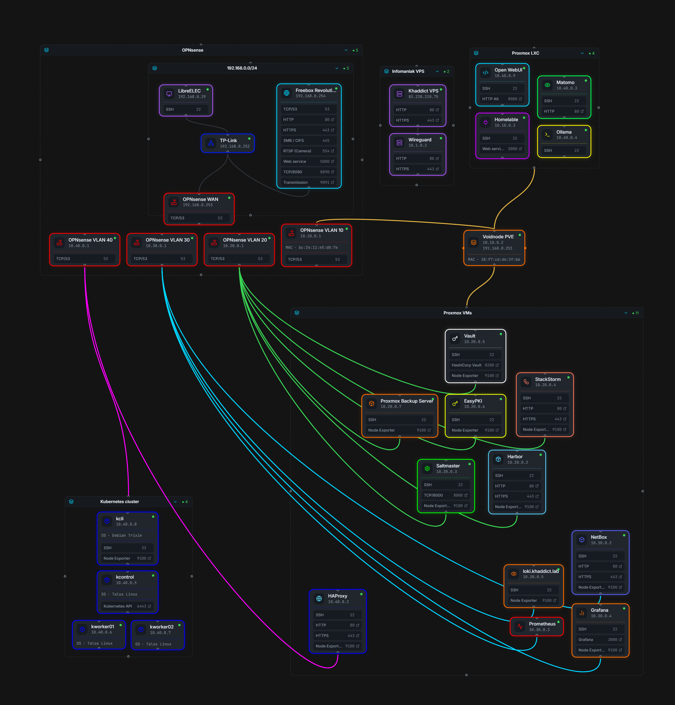

# Voidnode – Single node, segmented & secure


## Introduction

I used to run a fully HA homelab ([homelab](https://github.com/khaddict/homelab) & [homelab_cloud](https://github.com/khaddict/homelab_cloud)) with a three-node cluster and Ceph. If one node went down, everything kept running without issues. However, it also meant more maintenance and more hardware to manage. With three nodes, there were simply more components that could fail, and my hardware was starting to reach the end of its warranty.

Because of that, I decided to move to something simpler. By simpler, I mean less high availability. I now assume that if the node goes down, it's not a big deal. After all, it's just a homelab.

The new design isolates everything behind OPNsense on a dedicated `10.0.0.0/8` LAN, split into five VLANs for clear workload separation. Each VLAN has its own firewall rules: segments can only reach what they need, nothing more.

## Hardware


- [GEEKOM A9 Max Mini PC](https://www.geekom.fr/geekom-a9-max-mini-pc)
- [128GB DDR5-5600](https://www.crucial.fr/memory/ddr5/ct2k64g56c46s5)
- [4TB Samsung 990 EVO Plus NVMe](https://www.samsung.com/fr/memory-storage/nvme-ssd/990-evo-plus-4tb-nvme-pcie-gen-4-mz-v9s4t0bw)
- [Unifi Switch Lite 8 PoE](https://eu.store.ui.com/eu/en/products/usw-lite-8-poe)
- [Unifi U7 Pro](https://eu.store.ui.com/eu/en/products/u7-pro)
- [Raspberry Pi 5](https://www.raspberrypi.com/products/raspberry-pi-5/): runs [Kodi](https://kodi.tv/), unrelated to the lab's network/services
- [JetKVM](https://jetkvm.com/): remote KVM for the GEEKOM Mini PC (out-of-band console access to voidnode)

## Network architecture

```
 o
/|\ ── WireGuard ───┐                  inbound ──► Infomaniak VPS  (TCP passthrough)
/ \                 │                                   │
                    │                                WireGuard
                    │                                   │
                    ▼        192.168.0.0/24             ▼
ISP ◄── x.x.x.x ◄── Freebox (.254) ◄── (.253 - WAN) OPNsense (LAN - 10.10.0.1)
                                                        │
                                                        ├── VLAN 10 – CORE   10.10.0.0/24   core infrastructure
                                                        ├── VLAN 20 – ADMIN  10.20.0.0/24   management & automation
                                                        ├── VLAN 30 – INFRA  10.30.0.0/24   observability
                                                        ├── VLAN 40 – EDGE   10.40.0.0/24   external-facing services
                                                        └── VLAN 50 – IOT    10.50.0.0/24   public-facing IoT devices
```

All public traffic transits through an Infomaniak VPS before reaching the homelab. The VPS acts as a TCP passthrough proxy and never sees the TLS content. The connection between the VPS and the lab is maintained over a WireGuard tunnel, which means the residential IP is never exposed publicly. Every `*.khaddict.com` request hits the VPS first, gets forwarded through the tunnel, and lands on HAProxy at `revproxy` for SSL termination and routing.



Firewall policy follows a least-privilege model:

- **CORE** can reach all VLANs
- **ADMIN** can reach **INFRA** and **EDGE**
- **INFRA** can reach **EDGE**
- **EDGE** can only reach Vault and SaltMaster; it cannot initiate connections back to **ADMIN** or **INFRA**
- **IOT** cannot initiate anything outside its own segment, not even to the internet

A few explicit exceptions exist: Prometheus scraping across all VLANs, StackStorm SSH into PVE, Kubernetes widget calls reaching their respective backends, and the `api` VM (EDGE) reaching specific IoT devices on the IOT VLAN.

## VLAN 10 – CORE `10.10.0.0/24`

Core infrastructure. Full outbound access, all other VLANs isolated from it by default.

| Host | Type | Description |
|------|------|-------------|
| `opnsense.khaddict.lab` | VM | [OPNsense](https://opnsense.org/) firewall, VLAN routing, DNS (Unbound), NTP. Acts as the default gateway and DNS resolver for all segments. |
| `voidnode.khaddict.lab` | Node | [Proxmox VE](https://www.proxmox.com/en/proxmox-virtual-environment/overview) hypervisor. Hosts all VMs and LXC containers. Single bare-metal node. |

## VLAN 20 – ADMIN `10.20.0.0/24`

Management plane. Hosts all the tooling that operates, secures, and maintains the rest of the infrastructure. Cannot be reached from EDGE or INFRA directly.

| Host | Type | Description |
|------|------|-------------|
| `registry.khaddict.lab` | VM | [Harbor](https://goharbor.io/) container image registry. Stores custom-built Docker images used in Kubernetes. Also caches upstream images to avoid rate limits. |
| `saltmaster.khaddict.lab` | VM | [SaltStack](https://saltproject.io/) master. Manages configuration of all Debian/Ubuntu VMs via states. Orchestrates provisioning, service configuration, certificate deployment, and package management. Also hosts a [`khaddict-com`](https://github.com/khaddict/khaddict-com) build/preview environment under an unprivileged `website-dev` user (rootless podman-compose, `role/saltmaster/website_dev.sls`), replacing the previous dedicated preview VM. `website.khaddict.lab` is a CNAME to this host. |
| `stackstorm.khaddict.lab` | VM | [StackStorm](https://stackstorm.com/) event-driven automation engine. Runs a custom `st2_voidnode` pack that handles VM and LXC lifecycle (create, bootstrap, decommission, snapshot, template), PKI certificate provisioning, and sends Discord notifications. Triggered manually via CLI/API, or on a schedule (cron) for automated snapshots. |
| `vault.khaddict.lab` | VM | [HashiCorp Vault](https://www.vaultproject.io/). Central secrets store for the entire lab. SaltStack minions authenticate via AppRole with strict per-minion path isolation. Kubernetes workloads pull secrets at sync time via the ArgoCD Vault Plugin. |
| `easypki.khaddict.lab` | VM | Internal PKI authority ([EasyPKI](https://github.com/khaddict/easypki)). Issues and renews TLS certificates for all internal `*.khaddict.lab` services. Certificates are provisioned by StackStorm and distributed by SaltStack. |
| `pbs.khaddict.lab` | VM | [Proxmox Backup Server](https://www.proxmox.com/en/proxmox-backup-server). Stores VM backups on a dedicated 500GB disk. Most VMs back up nightly, with a few exceptions (PBS itself, stateless K8s nodes). |

## VLAN 30 – INFRA `10.30.0.0/24`

Observability stack. Read-only access to the rest of the infrastructure: Prometheus is allowed to scrape metrics from all VLANs, but INFRA cannot initiate other connections to ADMIN or CORE.

| Host | Type | Description |
|------|------|-------------|
| `netbox.khaddict.lab` | VM | [NetBox](https://github.com/netbox-community/netbox) IPAM/DCIM. Source of truth for IP allocation and VM inventory alongside `data/main.yaml`. |
| `prometheus.khaddict.lab` | VM | [Prometheus](https://prometheus.io/) metrics collection. Scrapes `node_exporter` from all VMs across all VLANs, runs `blackbox_exporter` ICMP probes, and triggers Alertmanager notifications: always to Discord, plus the BUSY Bar wall for critical/warning severity (bearer-token authenticated webhook to `api`'s `/wall/alert`). |
| `grafana.khaddict.lab` | VM | [Grafana](https://grafana.com/) dashboards. Visualizes metrics from Prometheus and logs from Loki in a unified interface. |
| `loki.khaddict.lab` | VM | [Loki](https://grafana.com/oss/loki/) log aggregation backend. All VMs ship logs via Promtail (deployed globally by SaltStack). Queried from Grafana. |

## VLAN 40 – EDGE `10.40.0.0/24`

External-facing services. Can reach Vault (secrets), SaltMaster (configuration), and Loki (log shipping), but cannot reach ADMIN or INFRA otherwise. The `api` VM additionally holds a narrow exception to reach specific devices on the IOT VLAN (see below).

| Host | Type | Description |
|------|------|-------------|
| `revproxy.khaddict.lab` | VM | [HAProxy](https://www.haproxy.org/) reverse proxy. Handles SSL termination for all public `*.khaddict.com` domains except `status.khaddict.com` (terminated directly on the VPS, see Network architecture). Routes by hostname to the appropriate backend: Kubernetes Envoy Gateway, Matomo LXC, or the API VM. Certificates renewed via Infomaniak DNS API. |
| `kcontrol.khaddict.lab` | VM | [Talos Linux](https://www.talos.dev/) Kubernetes control plane. Manages the cluster API. No SSH, fully API-driven via `talosctl` and `kubectl` from `kcli`. |
| `kworker01.khaddict.lab` | VM | [Talos Linux](https://www.talos.dev/) Kubernetes worker node 1. Runs workloads. |
| `kworker02.khaddict.lab` | VM | [Talos Linux](https://www.talos.dev/) Kubernetes worker node 2. Runs workloads. |
| `kcli.khaddict.lab` | VM | Kubernetes admin workstation. Holds `kubeconfig`, `talosconfig`, runs `kubectl` and [ArgoCD](https://argo-cd.readthedocs.io/) bootstrap scripts. Entry point for all cluster operations. |
| `api.khaddict.lab` | VM | Public gateway API (FastAPI, gunicorn/uvicorn behind nginx) for IoT devices. Exposed publicly at `api.khaddict.com` via `revproxy`. Routes: `/wall/message`, `/wall/image` and `/wall/audio` push visitor content to the BUSY Bar (serialized through an internal queue, so one send can't cut another off mid-display), `/wall/screen` mirrors its live display back to the site, `/wall/alert` receives alert webhooks from Alertmanager, StackStorm, and Uptime Kuma to show critical/warning alerts, `/wall/report` shows a pass/fail summary (used by StackStorm's snapshot job), `/blog/views/{slug}` increments a post's view counter, `/busybar/status` and `/healthz` report state, `/docs` serves the stock Swagger UI. The domain root (`/` and `/fr/`) serves a separate, site-styled API documentation page built in the [`khaddict-com`](https://github.com/khaddict/khaddict-com) repo and fetched directly from GitHub raw via Salt (same mechanism as the VPS fallback page below, different target): a third deployment path for that repo, alongside the Helm chart and the fallback page. Holds the sole firewall exception from EDGE into the IOT VLAN. |
| `matomo.khaddict.lab` | LXC | [Matomo](https://matomo.org/) web analytics (Caddy + PHP 8.3-FPM + MariaDB). Tracks `khaddict.com`, `blog.khaddict.com`, `media.khaddict.com`, `projects.khaddict.com`. Snippet baked into the static HTML at build time in the [`khaddict-com`](https://github.com/khaddict/khaddict-com) repo. Exposed publicly at `matomo.khaddict.com`. |
| `ollama.khaddict.lab` | LXC | [Ollama](https://ollama.com/) local LLM inference server. 50GB RAM, 16 cores. Runs large models locally without cloud dependency. |
| `openwebui.khaddict.lab` | LXC | [Open WebUI](https://openwebui.com/) frontend for Ollama. Browser-based chat interface. |
| `homelable.khaddict.lab` | LXC | [Homelable](https://homelable.net/), a self-hosted visual mapper of the homelab. Interactive network diagram with live status monitoring. |
| `unifi.khaddict.lab` | LXC | Unifi network controller. Manages the Unifi Switch Lite 8 PoE and the Unifi U7 Pro AP. |
| `pihole.khaddict.lab` | VM | [Pi-hole](https://pi-hole.net/) network-wide DNS ad-blocking and DNS server. |

## VLAN 50 – IOT `10.50.0.0/24`

Public-facing IoT devices. Joins a dedicated Wi-Fi SSID broadcast by the Unifi U7 Pro AP. Denied by default in every direction, including internet. The only traffic allowed is DNS/NTP to the firewall. The `api` VM (EDGE) is granted narrow, per-device exceptions to reach into this VLAN; nothing here can initiate a connection back out.

| Host | Type | Description |
|------|------|-------------|
| BUSY Bar | Device | [BUSY Bar](https://busy.app/) concentration timer, 72×16 LED display. Driven by the `api` VM over its local HTTP API, which lets visitors of `khaddict.com` push text, image, and audio messages to the physical display (its live screen mirrors back to the site), plus critical/warning infra alerts from Alertmanager. First device on this VLAN; more IoT gadgets may join the same segment later. |

## Kubernetes cluster

Three-node Talos Linux cluster on VLAN 40. GitOps-managed via ArgoCD. Every workload is defined as a Helm chart in this repository and synced automatically.

**System components:**

| App | Role |
|-----|------|
| [MetalLB](https://metallb.io/) | Allocates LoadBalancer IPs from the EDGE subnet (L2 mode) |
| [Envoy Gateway](https://gateway.envoyproxy.io/) | Implements Kubernetes Gateway API; all services are exposed via HTTPRoute |
| [Local Path Provisioner](https://github.com/rancher/local-path-provisioner) | Provides `local-path` StorageClass backed by `/var/local-path-provisioner` on the node |
| [Metrics Server](https://github.com/kubernetes-sigs/metrics-server) | Exposes resource metrics for HPA and kubectl top |
| [VictoriaMetrics](https://victoriametrics.com/) | Metrics stack (vmsingle + vmagent + vmalert) for cluster observability, alerts routed to Alertmanager |
| `node-shell` | Privileged DaemonSet giving a root shell on any worker node for debugging |

**Services:**

| App | Description |
|-----|-------------|
| `dashboard.khaddict.com` | Dashboard (Homepage). Aggregates widgets from PVE, ArgoCD, PBS, Prometheus, Grafana, OPNsense. Secrets injected from Vault via AVP. |
| `www.khaddict.com` / `blog.khaddict.com` / `media.khaddict.com` / `projects.khaddict.com` | Helm chart (`argocd/apps/khaddict`), one `khaddict` namespace, per-site Deployment/Service/HTTPRoute templated from `values.yaml`. Site content (HTML/CSS/JS, shared 404 page, security headers) lives in the separate [`khaddict-com`](https://github.com/khaddict/khaddict-com) repo, pulled in as a Helm subchart dependency published to `oci://ghcr.io/khaddict/charts`. |
| `assets-gui` | Internal asset manager (Streamlit UI + FastAPI backend, 5Gi PVC) |
| `changedetection` | Monitors websites for content changes, 5Gi PVC |
| `dnsutils` | Minimal debug pod in the `dnsutils` namespace for DNS troubleshooting |
| `remark42` | Comment widget for `blog.khaddict.com`, embedded as an iframe. GitHub-only auth, 5Gi PVC (BoltDB storage + backups), secrets from Vault at `kv/data/kubernetes/remark42`. |

Secrets are injected at ArgoCD sync time by the **ArgoCD Vault Plugin** using `<path:kv/data/kubernetes/<app>#FIELD>` annotations, authenticated with a long-lived Vault token.

## Configuration management: SaltStack

All Debian/Ubuntu VMs are managed by SaltStack. States are organized in five layers:

- `global/`: applied to every host in `data/main.yaml`'s Proxmox inventory: networking, SSH hardening, user management, DNS resolution, CA certificate trust, Promtail, node-exporter, blackbox-exporter, Vault client configuration. The external VPS (see "External exposure" below) is excluded by minion ID in `top.sls`, since it isn't Proxmox-managed and several of these states assume that inventory.
- `role/`: per-service states applied to specific minions: `api`, `easypki`, `grafana`, `kcli`, `loki`, `netbox`, `pbs`, `pihole`, `prometheus`, `pve`, `registry`, `revproxy`, `saltmaster`, `stackstorm`, `unifi`, `vault`, `vps`
- `base/`: shared vendor apt-repo and package-installation states (Grafana/Loki/Promtail, HashiCorp Vault, SaltStack, node/blackbox exporters) included by `global/` and `role/` states rather than applied to any host on its own
- `independent/`: minimal one-time bootstrap states (`vm.sls`, `lxc.sls`, `vps.sls`) applied once via `salt-ssh` to turn a fresh host into a minion, before `global`/`role` states take over on an ongoing basis
- `data/`: YAML source of truth consumed by states: `main.yaml` (full inventory), `versions.yaml` (pinned versions), `packages.yaml`

Minions authenticate to Vault via AppRole (`auth/salt-minions`). Each minion has a Vault entity with a `minion-id` metadata tag. The `minion-isolated` policy uses `{{identity.entity.metadata.minion-id}}` templating so that, for example, `netbox` cannot read `registry`'s secrets and vice versa.

## External exposure

Public traffic arrives at an **Infomaniak VPS** first. nginx does SNI-based TCP routing (stream module + `ssl_preread`): `status.khaddict.com` is terminated locally on the VPS, everything else is forwarded as raw TLS passthrough to HAProxy at `revproxy` (over the WireGuard tunnel) with PROXY protocol to preserve the real client IP. HTTP (port 80) is redirected to HTTPS at the VPS level.

```
Browser
  → nginx VPS :443 (SNI routing via ssl_preread)
    ├── status.khaddict.com    → local nginx vhost :4443 (SSL termination) → Uptime Kuma :3001 (same VPS)
    └── everything else        → HAProxy revproxy via WireGuard (PROXY protocol, SSL termination)
          ├── Kubernetes services    → Envoy Gateway HTTPRoute
          └── matomo.khaddict.com    → Matomo LXC
```

**Uptime Kuma** runs directly on the VPS (Node.js + PM2). nginx terminates TLS for `status.khaddict.com` locally and proxies straight to it on `localhost`, entirely bypassing WireGuard/HAProxy, so the status page stays up even if the entire homelab goes down. DNS on the VPS is resolved via its own ISP resolvers, never through the tunnel (see [documentation/KHADDICT-VPS.md](documentation/KHADDICT-VPS.md#9-configure-the-wireguard-tunnel-to-the-homelab)), keeping the VPS's own name resolution, including for the Discord alert webhook, independent of whether the homelab, and therefore the tunnel, is reachable.

If HAProxy becomes unreachable, the VPS automatically fails over (TCP/SNI level, no HTTP round-trip to the lab) to a static page served locally, returning a real `503` and sharing the same header, live status widget, and footer as the rest of the site. Falls back within `fail_timeout` (10s) and recovers automatically once HAProxy answers again. See [documentation/KHADDICT-VPS.md](documentation/KHADDICT-VPS.md#13-homelab-down-fallback-page).

**Public domains:** `khaddict.com` · `www` · `blog` · `dashboard` · `media` · `projects` · `api` · `matomo` · `status`

SSL certificates (`*.khaddict.com`) live on HAProxy and are renewed automatically via the Infomaniak DNS API.

## Inventory source of truth

Full VM/LXC inventory with hardware specs, VLAN assignments, IPs, and backup flags: [data/main.yaml](data/main.yaml).  
Firewall rules: [documentation/FIREWALL-RULES.md](documentation/FIREWALL-RULES.md).  
VPS setup: [documentation/KHADDICT-VPS.md](documentation/KHADDICT-VPS.md).  
Talos & Kubernetes upgrades: [documentation/KUBERNETES-UPGRADE.md](documentation/KUBERNETES-UPGRADE.md).  
Vault ACL policies: [documentation/VAULT-ACL-POLICIES.md](documentation/VAULT-ACL-POLICIES.md).

## License

[MIT](LICENSE)
